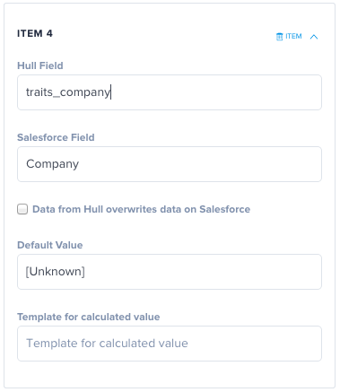

[Visit Salesforce website](http://salesforce.com)

__The Salesforce Connector allows you to sync your Hull users with Salesforce.__

This integration uses Salesforce API to synchronize your Hull users to create and update Salesforce Leads or Contacts.

## Getting started

### Fields mapping

The default setup comes with a standard mapping for common fields like `Email`, `FirstName` and `LastName` for Contacts and Leads, and `Website` for Accounts, which should cover most use cases.

For example, the following Hull User

    {
      "id": "51249ea3ae12bd621a000007",
      "last_seen_at": "2015-11-26T14:21:37Z",
      "updated_at": "2015-11-26T14:21:37Z",
      "created_at": "2013-02-20T10:00:03Z",
      "name": "Johnny Hull",
      "email": "hello@hull.io",
      "main_identity": "twitter",
      "first_name": "Johnny",
      "last_name": "Hull",
      "picture": "http://a0.twimg.com/profile_images/1250949364/gravatar_normal.jpg",
      "contact_email": "hello@hull.io",
      "phone": "+33144444444",
      "address": {
        "country" : "France",
        "city" : "Paris"
      }
      ...
    }

will be synchronized as the following Lead on Salesforce :

    {
      "Email" : "hello@hull.io",
      "FirstName" : "Johnny",
      "LastName" : "Hull",
      "Company" : "[Unknown]"
    }

Please note : The `Company` field is a required field on Saleforce Lead objects. The standard mapping will set it to `[Unknown]` by default.

### Custom mappings

If you capture specific information that need to be mapped to Salesforce custom fields, the settings section of this connector allows you to configure a custom mapping.

Let's for example capture the user's company using Hull's [Traits API](http://hull.io/docs/references/hull_js#traits)

In javascript :

    hull.asUser({ email: 'johnny@hull.io' }).traits({ company: 'Hull' })

And in the settings section of the connector, let's map this trait to the `Company` field on Salesforce.

### Synchronizing Users

When synchronizing a user, we will first look for a `Contact` with a matching email address. If we find one, it will be synchronized, if not, a matching `Lead` will be updated or created.

### Synchronizing Accounts

You can also choose to synchronize with Salesforce `Accounts`. If this feature is activated, we will update or create an `Account` with a matching domain.
As with `Contacts` and `Leads` you can define custom mappings for your Accounts.

## Salesforce API access

Authenticated access to Salesforce API is required for this integration to work. A Salesforce account email, password and security token will be stored in plain text in our database and used to make API calls to your Salesforce account.

The default password policy on Salesforce is to expire passwords after 90 days. When the password you provided expires, we won't be able to make API calls anymore, this integration will stop working.

You can setup your passwords to never expire on Salesforce in `Administration Setup > Security Controls > Passwod Policies`.

