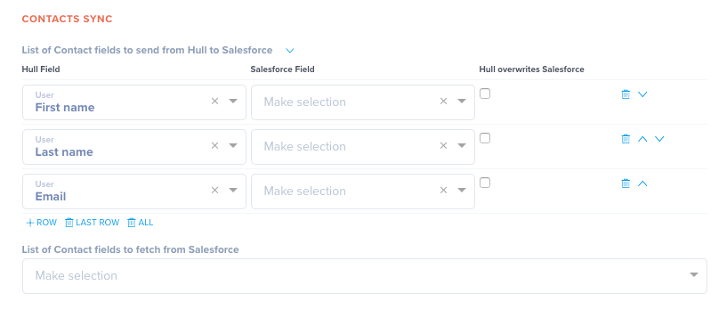

# Hull Salesforce Connector

The Salesforce Connector enables your team to sync Hull’s user profile data from and to your Salesforce system.

## Getting Started

Go to the Connectors page of your Hull organization, click the button “Add Connector” and click “Install” on the Salesforce card. After installation, stay on the “Dashboard” tab to grant the Connector access to your Salesforce system. Please note that you connect to your Production Environment by default. If you want to connect to a Sandbox Environment, please follow the steps under [Connect with a Sandbox Environment](#connect-with-a-sandbox-environment) before you click on “Continue with Salesforce:

You will get redirected to the login screen of Salesforce. Authenticate the request on the Salesforce website with your username and password:

After successful authentication you will be redirected to your Salesforce connector on Hull. You are now ready to complete your setup:

Please refer to following sections to

- [Specify the users who are getting synchronized](#specify-the-users-who-are-getting-synchronized)
- [Determine the fields to synchronize for Leads](#determine-the-fields-to-synchronize-for-leads)
- [Determine the fields to synchronize for Contacts](#determine-the-fields-to-synchronize-for-contacts)
- [Learn how Hull determines if a user is a Lead or Contact](#learn-how-hull-determines-if-a-user-is-a-lead-or-contact)

## Features

The Hull Salesforce Connector allows your organization to synchronize leads and contacts from and to our platform. Once you have your data in Hull, you can send it to other tools to keep your entire stack in sync.

The Salesforce connector supports to `create users`, `add traits` and `update traits`.

## Specify the Users who are getting synchronized

By default all users are synchronized between Salesforce and Hull, but you can customize this behavior and explicitly define the segments who are getting synchronized. Go to the “Settings” tab of the connector and locate the section “Connector Configuration”. Specify the segments in the following field:

## Determine the fields to synchronize for Leads

You can customize the fields which are getting synchronized with Salesforce in the section “Leads Sync” of the “Settings” tab. The first list determines the fields who are getting send from Hull to Salesforce. Please make sure that this list contains all required fields to create a lead in your Salesforce system. You can specify for each field whether data in Hull takes precedence over data in Salesforce by toggling the checkbox “overwrite”. If the box is checked, data from Hull will always take update the Lead record; if the box is unchecked, the field in Salesforce will only be updated with data from Hull if it has not been set.

The second list determines the fields Hull fetches from Salesforce. Salesforce data will always take precedence over data in Hull and update the user’s respective traits. Hull saves the data obtained from Salesforce in the trait group “Salesforce Lead”, so no standard trait data will be overwritten.

## Determine the fields to synchronize for Contacts

You can customize the fields which are getting synchronized with Salesforce in the section “Contacts Sync” of the “Settings” tab. The first list determines the fields who are getting send from Hull to Salesforce. You can specify for each field whether data in Hull takes precedence over data in Salesforce by toggling the checkbox “overwrite”. If the box is checked, data from Hull will always take update the Contact record; if the box is unchecked, the field in Salesforce will only be updated with data from Hull if it has not been set.

The second list determines the fields Hull fetches from Salesforce. Salesforce data will always take precedence over data in Hull and update the user’s respective traits. Hull saves the data obtained from Salesforce in the trait group “Salesforce Contact”, so no standard trait data will be overwritten.

## Connect with a Sandbox Environment

You can configure the Connector to connect to a specific Sandbox system. Go to the tab “Settings” and locate the field “Salesforce Login Url” under the section “Advanced”. Enter the login url of your Sandbox environment here and click “Save” to persist your changes.
Switch to the tab “Dashboard” and click on “Start Over” to authenticate against your Sandbox system; the steps to authenticate are described in [Getting Started](#getting-started).

Note: If you want to authenticate against your production environment, change this setting back to `https://login.salesforce.com` and click “Start Over” on the “Dashboard” tab. It is not recommended to switch between Salesforce environments within the same Hull organization because it can lead to inconsistent data. Please make sure that you understand the ramifications when changing this parameter.

## Learn how Hull determines if a user is a Lead or Contact

When Hull sends a user to Salesforce the system executes the following strategy to determine whether a user has to be treated as a Lead or Contact:

1. Hull checks if a contact with a matching email address exists; if this is the case, the Hull user is treated as a Contact in Salesforce and the selected fields in Salesforce are updated with the data from Hull. When no matching contact is found, step 2 is executed.
2. Hull checks if a contact with a matching email address exists; if this is the case Hull updates the selected fields in Salesforce. When no matching lead is found, step 3 is executed.
3. Hull creates a new lead in Salesforce with the selected fields.
